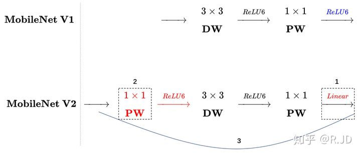

> https://zhuanlan.zhihu.com/p/70703846
> 
> https://zhuanlan.zhihu.com/p/31551004
## MobileNetV1  CVPR2017

- 普通卷积: 3×3Conv + BN +ReLU
- MobileNet卷积：3×3DepthwiseConv + BN +ReLU 和 1×1PointConv + BN +ReLU
- 参数量由原先的 3 × 3 × C_in × C_out 变为 3 × 3 × C_in + 1 × 1 × C_in × C_out
  

## MobileNetV2 CVPR2018
- 引入残差
    
  
  
  与ResNet的不同之处：

    - ResNet先降维(0.25)、卷积、再升维；MobileNetV2先升维(6倍)、卷积、降维；
    - 
- 将PointConv后的ReLU改为linear:
  - 作者认为激活函数在高纬空间能够有效在呢个价非线性，但在低纬空间则会破坏特征，不如线性效果好。
- 将ReLU改为ReLU6:模型在低精度计算下具有更强的鲁棒性
- 在DepthwiseConv前再加一个PointConv1×1
  

## MobileNetV3

0. 网络的架构基于NAS实现的MnasNet（效果比MobileNetV2好）
1. 引入MobileNetV1的深度可分离卷积
2. 引入MobileNetV2的具有线性瓶颈的倒残差结构
3. 引入基于squeeze and excitation结构的轻量级注意力模型(SE)
4. 使用了一种新的激活函数h-swish(x)
5. 网络结构搜索中，结合两种技术：资源受限的NAS（platform-aware NAS）与NetAdapt
6. 修改了MobileNetV2网络端部最后阶段

### 激活函数h-swish

- 随着网络的深入，应用非线性激活函数的成本会降低，能够更好的减少参数量
- 作者发现swish的大多数好处都是通过在更深的层中使用它们实现的
- 在V3的架构中，只在模型的后半部分使用h-swish(HS)

### NetAdapt
- 层级搜索（Layer-wise Search）: 用于对各个模块确定之后网络层的微调每一层的卷积核数量

### 对V2最后阶段的修改
- 出发点：作者认为，当前模型是基于V2模型中的倒残差结构和相应的变体（如下图）。使用1×1卷积来构建最后层，这样可以便于拓展到更高维的特征空间。好处是，在预测时有更多更丰富的特征来满足预测;同时也引入了额外的计算成本与延时。
- 需要改进的地方就是要保留高维特征的前提下减小延时
- 效果：不会造成精度损失的同时，减少10ms耗时，提速15%，减小了30m的MAdd操作

