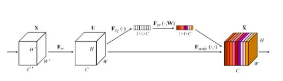

## ResNet

- 随着网络的架势，网络优化会变得更加困难。于是引入了short connection

### 网络结构
- ResNet 网络主要由两种block堆叠构成，一种是Basic Block，另一种是Bottleneck Block。少于50层的由Basic Block组成,大于50层的由Bottleneck Block组成。
   

- ResNet
  

### 特点
- 受到VGG启发，卷积层主要是3×3
- 输入部分 ：经过一个7×7,stride=2的卷积，再经过maxpool 3×3,stride=2。得到的特征图为输入的图的1/4。
  - 导致大量特征没有被利用，因此可以改为stride=1来减少信息损失，增大特征尺寸，但是会导致感受野减小
  - 7×7 卷积也可以改为三个3×3卷积，增加模型的非线性
- 不使用dropout
- 每个卷积后紧跟 BN层

## ResNetV2

- 主要是对ResNet中各部件的顺序进行调整

- Relu
  - 原因：原先残差相加后进入relu层，导致残差模块的输出永远是非负的，限制的模型的表达能力。
  - 将Relu放入残差模块中

- Pre-activation
  - 进入每个block 先进行BN + Relu，再卷积
  - 实验表明，调整后网络能够更容易优化，并且网络越深效果越明显
  
## Wider ResNet
- WRN 探讨了宽度对网络的影响，发现增加网络宽度能够提升网络的性能，且加宽网络相比加深网络计算更加高效

  
- 在两个conv 中间加入了dropout
  
## Dilated ResNet

- 将ReNet最后的两个stage换成Dilated Conv
  - 保留图像的基本细节
  - 全部stage换成Dilated Conv 开销太大
- 去除开始的的MaxPooling，并用两个残差模块替代。
  - 因为MaxPooling会保留大量的高频信息 

## ResNeXt
- 将inception思想与ResNet思想相结合
- 证明除了网络的深度、宽度外，还能通过增加cardinality 来提升模型的性能
  

## SE-ResNet
- SENet 是在通道维度上做attention，是模型更加关注信息量大的通道特征。
- 中心思想：对于每个输出的channel，预测一个常数权重，对每个channel加权。
    

- 具体操作
  - Squeeze：对每个通道输出，进行global average pooling,得到一个标量值。
  - 然后经过FC-Relu-FC-Sigmoid 得到0~1之间的标量，作为通道的加权。 

## ResNeSt 
- 在SENet、ResNeXt的基础上提出了Split-Attention模块，用于替换ResNet的四个stage的Conv
- ResNeSt模块
  
  