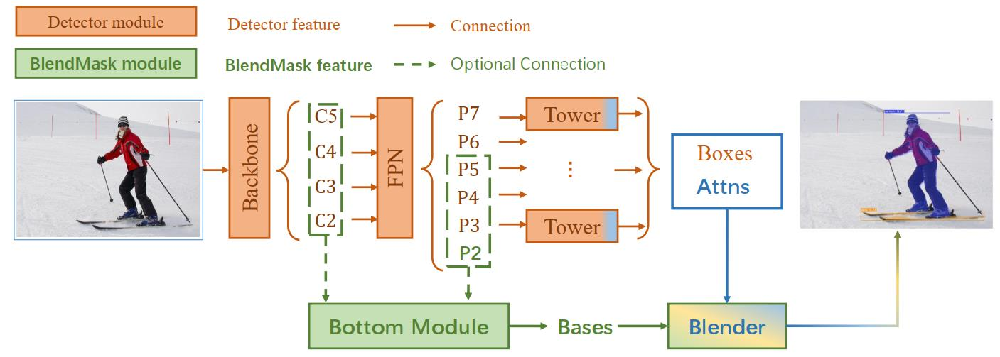

# BlendMask:
## 背景
### 自上而下
- 思路：首先通过目标检测的方法找出实例所在的区域（bounding box），再在检测框内进行语义分割，每个分割结果都作为一个不同的实例输出。
- 开山鼻祖是DeepMask，它通过滑动窗口的方法，在每个空间区域上都预测一个mask proposal。
- 缺点：
    - mask与特征的联系丢失（局部一致性 ）
    -  特征的提取表示是冗余的， 如DeepMask对每个前景特征都会去提取一次mask
    - 下采样导致的位置信息丢失
### 自下而上
- 思路：首先进行像素级别的语义分割，在通过聚类、度量学习等区分不同的实例
- 缺点：
    - 对于密集分割的质量要求很高
    - 泛化能力差，无法应对类别较多的复杂场景
    - 后处理方法繁琐

## 概要
- BlendMask结合Top-down和Bottom-up的方法。
- 通过anchor-free检测器FCOS的基础上，增加Bottom Module提取low-level的细节特征，并在instance-level上预测一个attention；
- 借鉴FCIS与YOLACT的融合方法，提出了Blender模块来更好的融合这AnGg特征

## BlendMask

BlendMask由三部分组成：
- bottom module用来对低层特征进行处理，生成score map 称为Base(B)
- top layer 接在检测器的box head上，生成top level attention(A)
- blender 对B与A进行融合
### Bottom Module
- 输入大小
```math
N × K × \frac{H}{s} × \frac{W}{s}
```
是由骨干网络或者FPN输出的低层特征

- 通过一系列decode操作（上采样和卷积）生成score map

### top layer
- 在检测金字塔的每一层后，都加一层卷积，用来预测top-level attentions(A) 
- 大小
```math
N × (K·M·M) × H_l × W_l
```
- M为Attention的分辨率

### Blender
- 输入：
 - detector tower生成的bbox proposal（P）维度为 : K × H' × W'

 - top layer 生成的A 维度 :K × M × M
 - bottom module生成的B，大小为：K × H × W
- 步骤
 1. 对于B，使用ROIPooler,在B上crop出P对应的区域，并resize到R×R大小，得到：
```math
r_d = K × R × R
```
 2. 对于A，根据FCOS的后处理方法，选出前D个检测框的对应的A；并通过ROIAlign和reshape将A的维度由(k*M*M,H,W)调整为：
```math
a = K × M × M
```
 3. 对于a，由于一般M小于R，通过插值将a转化为
```math
a_d = K × R × R
```
 4. 对a在K维度上softmax，得到score map
```math
s_d = K × R × R
s_d = softmax(a_d)
```
 5. 融合
```math
m_d = \sum_{k=1}^K{s_d^k ·r_d^k}

```


