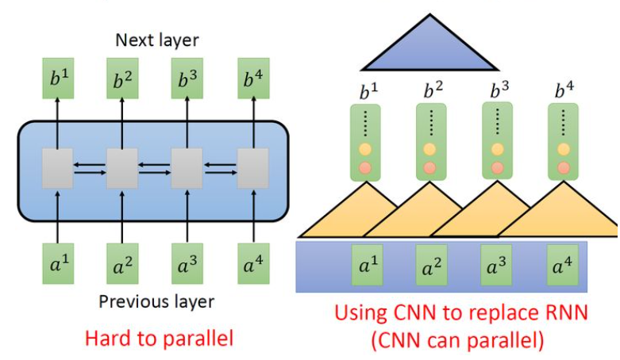
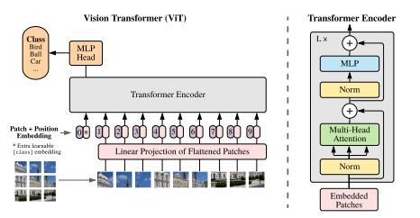
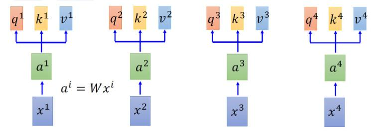
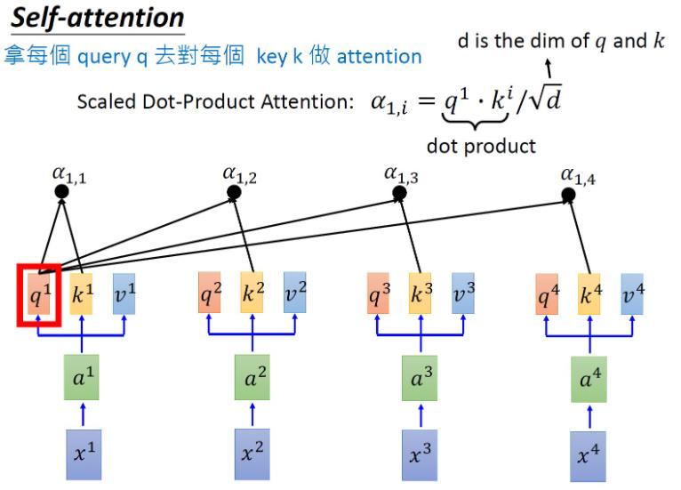
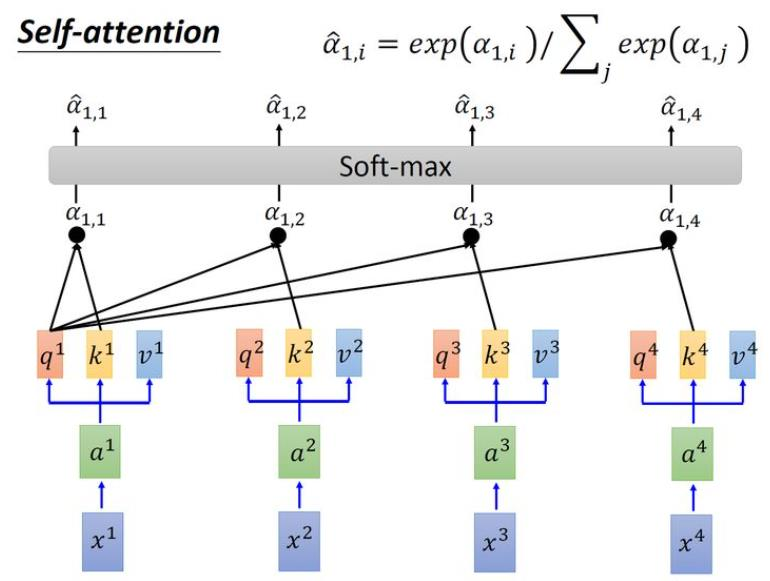
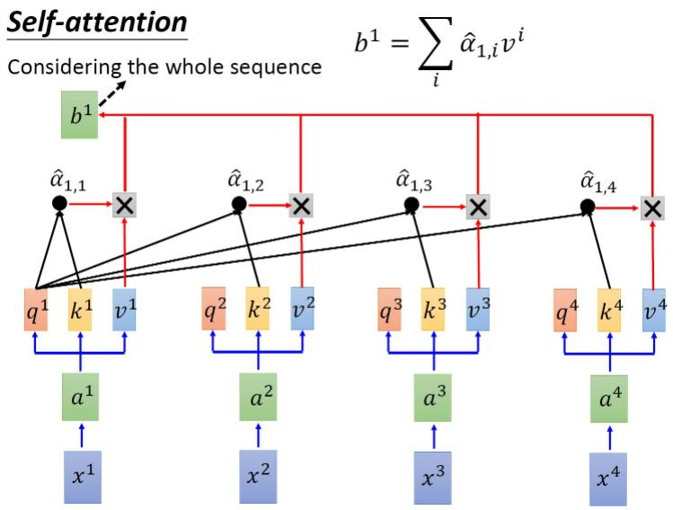
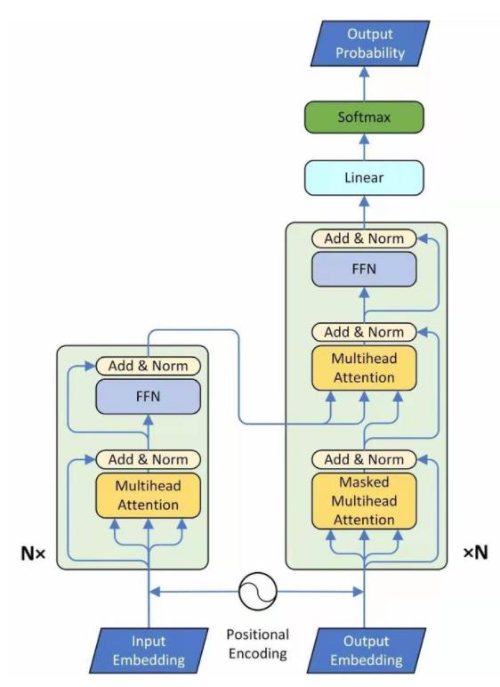

# ViT: An Images is Worth 16×16 Words:Transformers for Image Recognition at Scale

> https://zhuanlan.zhihu.com/p/359071701 (中文翻译)
> https://github.com/lucidrains/vit-pytorch (pytorch代码)
> https://zhuanlan.zhihu.com/p/340149804 (这个牛)
## 概述
- 用Transformer Encoder 替换掉CNN网络，进行图像分类。
- ViT的意义在于让Transformer真正在CV领域work

- 如上图所示，CNN与RNN可以做到相同的输入和输出，但CNN只考虑非常有限的内容,如图右侧CNN只考虑三个vector，而RNN考虑所有vector。
- 当然CNN也是能够考虑更多vector比如第二层能够考虑六个vector，多次堆叠，更上层的filter能够看到更多的信息。
## ViT

- Transformer的输入是一维的词序列，而图片是二维的
- 为了处理二维的图像 我们将 H×W×C大小的图片切片为N个Patch，尺寸为(N×(P×P×C)),其中(P,P)为Patch的大小，N =WH/PP
- 通过对patch数据进行线性映射或者利用ResNet对patch提取特征，得到Patch Embedding
- 位置embedding会添加到patch embedding中，以保留位置信息
  

## Self-Attention

- 假设输入为x1~x4,每个vector先乘上矩阵W得到embedding，即图中的a1~a4
- !!! 位置向量ei在此与ai相加
- 每个embedding分别乘上三个不同的transformation矩阵Q,K,V,得到三种不同的向量

- 每个q去对每个k做attention(attention 就是匹配这两个向量有多接近)
- 因为q·k的值会随着dimension的增大而增大所以要除以根号dimension

- 把所有的得到的值做softmax操作

- 把a1,1乘上v1，a1,2乘上v2，… 最后相加得到b1
- 同样的方法计算得到b2~b4  

## NetWork

## 缺点
- 小规模数据集，ViT不work（ILSVRC2012 ImageNet 1.3M张图片）
- 相比于 CNN模型TransformerEncoder不包含图像分类相关的归纳偏置(inductive bias)，比如缺少旋转不变性、局部性
  