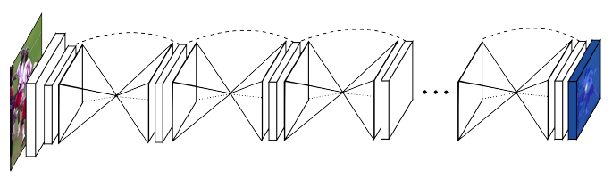
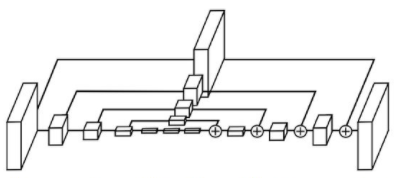
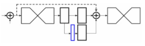

# Stacked Hourglass Networks for Humans Pose Estimation

> https://zhuanlan.zhihu.com/p/57631965 (姿态估计： Hourglass 网络)  
> https://zhuanlan.zhihu.com/p/45002720 (论文笔记Stacked Hourglass Networks)  
> https://zhuanlan.zhihu.com/p/65123312 (Stacked Hourglass Networks简析）  
> https://github.com/umich-vl/pose-hg-train (GITHUB,pyorch)  
> https://blog.csdn.net/saturdaysunset/article/details/84204564 (代码详解)
## 简介
- 因为长得像沙漏，故取名为Hourglass 
- Hourglass结构是由对称的bottom-up和top-down两部分组成
- (ps. 感觉就是U-Net用上了res结构)

## Hourglass结构

- 设计目的: 为了捕捉每个尺度下的信息，既获得局部的特征又保留整体的姿态信息
- bottom-up(高分辨率到低分辨率) max pooling
- top-down(低分辨率到高分辨率) 最邻近插值
- 输出：通过1×1卷积得到一个heatmap，通道数为Pose的个数

## 中继监督（inermediate Supervision）

- 每个级联预测一个heatmaps（图蓝色部分）
- 整个网络使用了8个Hourglass,heatmaps与GT比对产生loss，最终8个loss相加
- 其本质就是预测中间heatmaps

## 损失函数
heatmaps与GT差的 L2范数（MSE）
