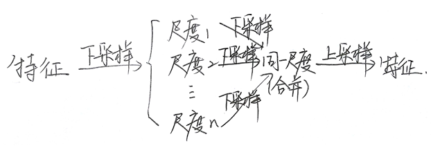

# Learning Feature Pyramids for Human Pose Estimation，ICCV2017

>https://zhuanlan.zhihu.com/p/351194136 (论文翻译)  
>https://www.cnblogs.com/CZiFan/p/10025081.html (理解)  
## 概要

- Learning Feature Pyramid 仅仅是在Hourglass的基础上 引入了PRMs(特征金字塔+残差)
- 提出了 frachtional max-pooling

## Pyramid Residual Modules(PRMs)
### 尺度不变性

## frachtional max-pooling
由于传统的pooling操作对于像素的减少太快以至于太过于粗糙，因此论文提出了一种新的fractional max-pooling方式，使得下采样的尺度平滑