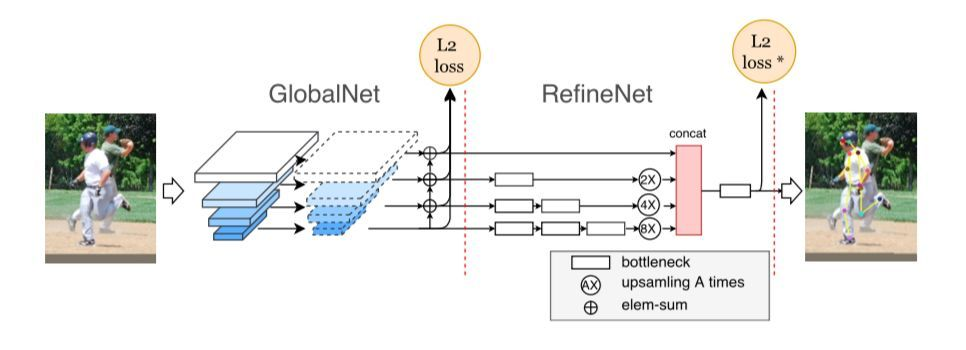

# Cascaded Pyramid Network for Multi-Person Pose Estimation
> https://github.com/GengDavid/pytorch-cpn (GITHUB)   
> https://zhuanlan.zhihu.com/p/270935572 (人体姿态估计论文笔记-CPN)
## 概述
- 主要这针对一些难例,如被遮挡，不可见，复杂环境
- stacked hourglass的算法里发现，堆叠的策略某种程度上有效，但实际上堆叠两个hourglass module和8-stage的hourglass module表现差的也并不多，所以基于这个发现，作者提出了2-stage的网络：GlobalNet和RefineNet
## Network

整个网络结构分为 GlobalNet与RefineNet,GlobalNet生成的特征金字塔用于识别简单的case，RefineNet显示的处理困难的case 

### GlobalNet
ResNet + RPN 

### RefineNet
- 使用concat将多层特征整合
- 随着训练的进行，网络会倾向于关注占比较多的“简单”点，其重要性不及“困难”点，比如遮挡等情况
- RefineNet 根据训练损失在线地显式选择困难关键点（称之为在线困难关键点挖掘/ OHKM）
