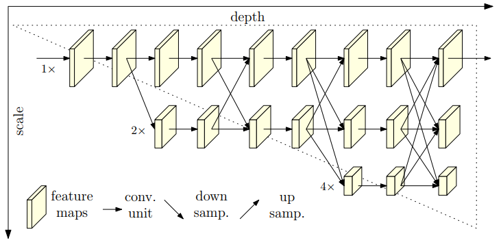

# Deep High-Resolution Representation Learning for Human Pose Estimation
> https://www.cnblogs.com/dilthey/p/11182948.html (手绘网络结构，很详细)

## 综述
- HRNet在整个过程中维护高分辨率的表示
- 我们从高分辨率子网作为第一阶段始，逐步增加高分辨率到低分辨率的子网，形成更多的阶段，并将多分辨率子网并行连接
- 提出了一种新的高低分辨率特征融合方式
## 网络结构

