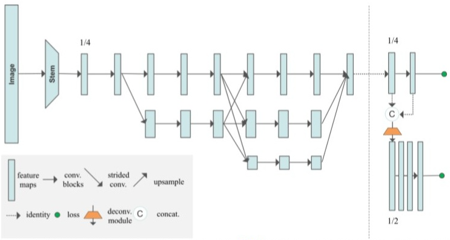
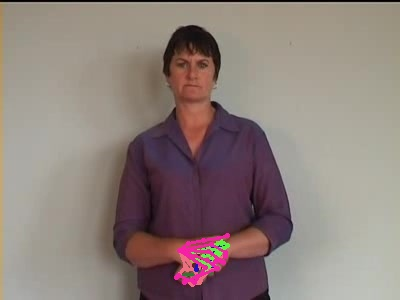

# HigherHRNet:Scale-Aware Representation Learning for Bottom-Up Human PoseEstimation
> https://zhuanlan.zhihu.com/p/143939662  (翻译)  
> https://github.com/HRNet/HigherHRNet-Human-Pose-Estimation (GITHUB)
## 概述
- bottom-up方法由于尺度的变化，无法准确预测小目标
- HigherHRNet 利用高分辨率特征金字塔尺度感知，训练时多分辨率监督，推理时多分辨率聚合

## HigerHRNet

- 网络使用HRNet作为backbone，后续连接一个或多个反卷积模块以生成更高分辨率的热图
- 反卷积模块
    - 输入:为HRNet的特征以及预测热图 
    - 输出：比输入特征图大两倍的新特征图
    - 如果需要更大的分辨率，可以添加更多的反卷积模块。在COCO数据集上实验正面单个反卷积模块效果最佳
- Grouping

    使用关联嵌入方法，为每个关键点分配一个“tag”(向量表示)，并根据向量之间的L2距离对这些关键点进行分组

- Heatmap Aggregation for Inference
   热图鞠策策略，使用双线性插值的方法将不同分辨率的所有预测热图上采样到输入图像的分辨率，并平均所有尺度热图得到最终的预测结果

## MPII_HAND数据集上的效果
单卡10h，初步训练效果

当目标密集重叠时效果较差
