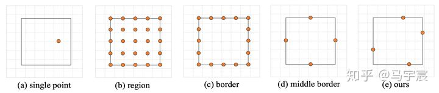
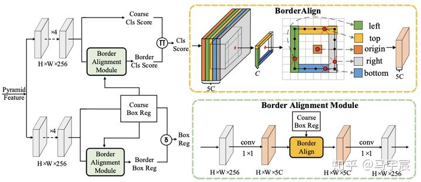
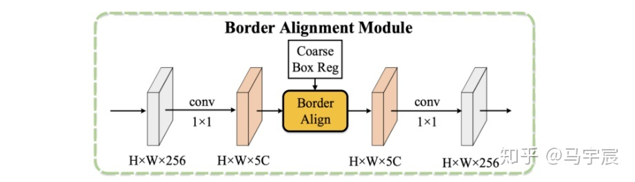

## 背景
- 目前的检测器都是使用simple point特征去预测分类和回归，但只用一个点的特征很难捕捉物体的便捷信息精准定位
- 论文认为边界极限点特征对边界框的定位至关重要

## 验证实验
1. single point:单点特征
2. region：用ROIAlign提取框内所有特征
3. border: 使用边界上所有点的特征
4. mid-border：使用边界上中心点的特征
5. BorderAlign: 边界极限点

## 方法

### BorderAlign
- 对于一个特征图，通道个数为5xC，这是一个border-sensitive的特征图，分别对应物体4个边界特征和原始anchor点位置的特征。
- 对于一个anchor点预测的一个框，我们把这个框的4个border对应在特征图上的特征分别做pooling操作
- 如图所示，我们每条边会先选出5个待采样点，再对这5个待采样点取最大的值，作为该条边的特征，即每条边最后只会选出一个采样点作为输出。那么每个anchor点都会采样5个点的特征作为输出，即输出的通道数也为5xC个。

### BAM(Border Alignment Module)

- 对于来自于FPN的特征，borderAlign需要5xC的border-sensitive的特征图，所以需要将通道先升维，提取完后再降维。
- 为了“最干净”的验证Border feature的有效性，BAM中使用1x1conv来做升降维，几乎不增加模型的计算量。
- 最后还原到256通道，来做最终的边界的分类和回归。

