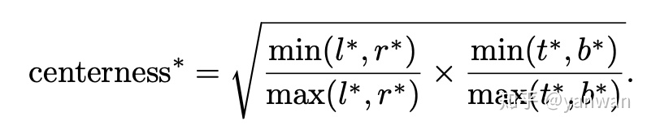

# FCOS:Fully Convolutional One-Stage Object Detection

## 背景
### anchor-base检测器的缺点
- anchor的大小，宽高比，不同框的数量都会影响检测器的效果；
- 小目标难以检测
- 为了提高召回率，需要更多的anchor防止漏检，而其中大部分是负样本
- 计算IOU时大量的anchor box 计算量大
### anchor-free检测器的缺点
- YOLOV1:只检测中心点附近的目标（YOLOV2提到了该缺点，故YOLOV2使用了anchor-based） 
- ConerNet 需要比较复杂的后处理

## 边界框的表示形式
- FCOS不再学习预测目标的中心点，对每个位置学习它到GT BOX的上、下、左、右的距离（t,b,l,r)

## 样本分配
- step1 分配目标给哪一层 
    - FCOS有5个feature map（P3、P4、P5、P6、P7）设定五组阈值分别是(0,64)(64,128)(128,256)(256,512)(512,∞)
    - 计算出(t,b,l,r) 取其中最大值m = max(t,b,l,r)
- step2 确定正负样本
    - 通过center_sample_radius参数,确定半径范围内的样本属于正样本
    - 默认配置center_sample_radius=1.5,例如第一层的stride =8,则对于一个gt，基于gt中心为起点，在半径为1.5*8=12个像素范围内都属于正样本
- step3 centerness 寻找目标中心点。
    - 离目标中心点越近,输出值越大，反之越小
    

## LOSS
1. 类别loss: Focal Loss
2. 回归loss: IOU Loss
3. center-ness loss :使用BCE loss将其加入

## 总结

FCOS 从一个点开始利用该点与GT之间的水平垂直距离(l,t,r，b)来表示边界框, 并通过引入 层、区域、中心 确定正负样本的分配。