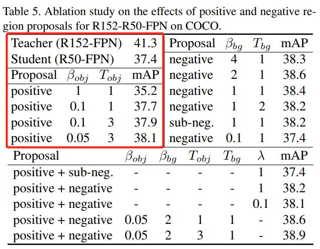
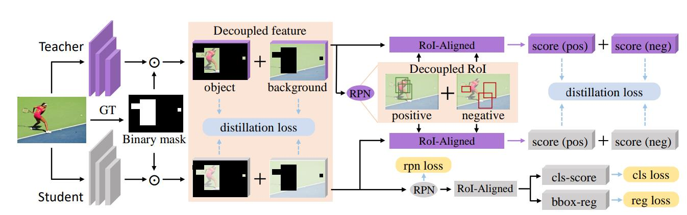

# Distilling Object Detectors via Decouple Features

## 总结
1. 分析证明了背景区域在蒸馏过程中的重要性
2. 特征在FPN水平与ROI-aligned特征水平，分割成物体与背景，分别进行蒸馏

## 背景重要性

### 目标(正样本)的损失 > 背景(负样本)的损失
-  如果不平衡样本，背景产生的的小梯度，将被目标产生的大梯度淹没
### 只用负样本 > 平等的对待正负样本
   

## 网络结构
