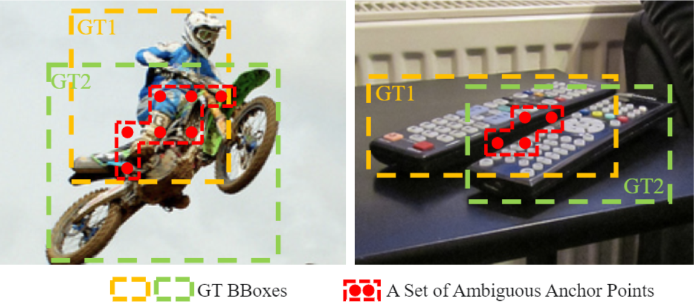

# OTA:Optimal Transport Assignment for Object Detection
> [Label Assignment] 感觉这篇有点水
## 综述
### 模糊Anchor
-  模糊anchor：一个anchor被分配给多个gt
-  
-  现有的分配策略都依赖于固定的分配策略
   - RetinaNet 基于IOU,将anchor分配给IOU最大的GT
   - FCOS 分配给面积最小的GT 
- 作者认为，将模糊的anchor分配给任何gt或者背景都会对其他gt的梯度造成不理的影响
- 总而言之，全局最优！

### DeTR 全局最优
- DeTR是第一个从全局考虑标签分配
- 使用transformer替代检测头，使用匈牙利算法一对一匹配，对每个gt匹配一个具有全局最小损失的query
- 对于CNN检测器，网络通常会产生与目标周围相邻区域相关的分数，因此会给每个GT分配多个anchor
  
## OTA

- 将一个单元的标签从GT到anchor的代价Cost，定义为它们cls loss 与reg loss 的加权相加;背景只需要计算cls loss
- dynamic k ：对于每个GT，挑选top q高的iou的predicted-box，并将iou相加，来代表每个gt的估算positive anchors数量，也就是公式中的K。
- center prior