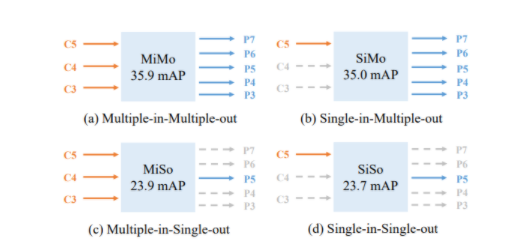
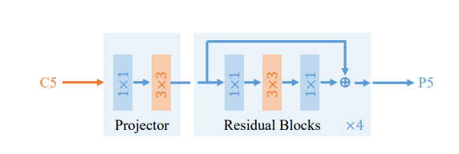

# YOLOF：You Only Look One-level Feature

> https://zhuanlan.zhihu.com/p/359462538 (YOLOF解读)
> https://zhuanlan.zhihu.com/p/370758213 (mmd代码实现)
## 概述
- FPN关键的贡献在于“分治”的思想，而不是多尺度特征融合

## 实验

- 作者设计了MiMo、SiMo、MiSo、SiSo四种解码器
- 从结果上看，SiMo仅仅采用C5特征不进行特征融合能够与MiMo取得相当的性能
- 结论：
    - C5包含了充分的用于检测不同尺度目标的上下文信息，这促使SiMo编码器可以取得与MiMo相当的结果
    - 多尺度特征融合带来的收益要远小于分而治之带来的收益，因此多尺度特征融合可能并非FPN最重要的影响因素；

## 关键组件
### Dilated Encoder

- 如果只用Backbone中的C5作为输入，会导致C5特征的感受野所对应的尺寸范围受限
- 使用1×1卷积减少通道数，再使用3×3卷积提炼语义信息，最后使用4个空洞残差单元获取不同的感受野特征
  
### Uniform Matching
- 一般采用Max-IOU Matching(如果IOU大于0.5则为正样本)
- 但采用SiSoEncoder时，秒点的数量会大幅减少，导致稀疏锚点，进一步导致Match问题
- 策略：对每个目标框采用K近邻锚点为正锚点，确保所有目标框能以童谣数量的正锚点进行均匀分配

## 个人思考
- 本质上就是在C5后面加了一层增大感受野的特征，开FPN的倒车
- SiSoEncoder + Dilated Encoder ==  SiMoEncoder ，仅仅是包装了一种实现思路
  
- 疑惑：C5本身就是大感受野，继续做空洞卷积不应该只能获得比C5更大的感受野嘛，没有获得小目标的小感受野，单纯扩大感受野的意义是什么？C5不够大嘛？（所以也是导致小目标性能更弱于RetinaNet）
