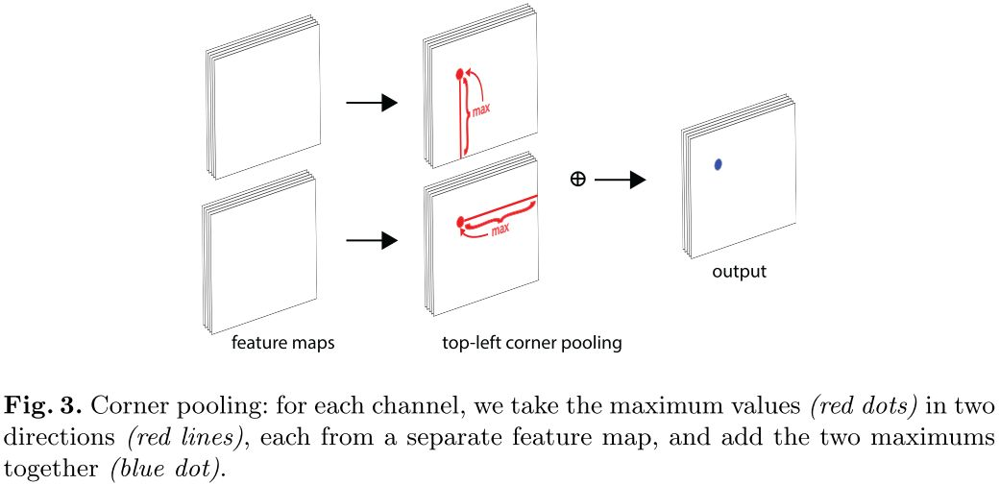
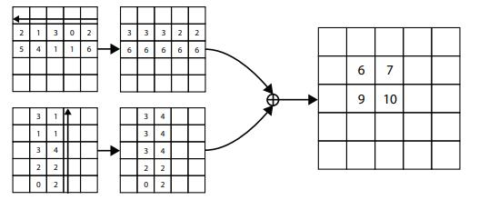
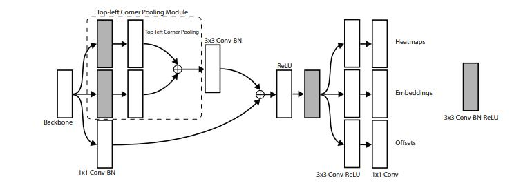

# CornerNet:Detecting Objects as Paired Keypoints

## 边界框的表示形式
-  左上角和右下角的坐标

## Corner Pooling
  
-   在每个pixel位置，最大池化的第一个FeatureMap右方所有特征向量
-   最大池化第二个FeatureMap下方的所有特征向量
-   将两个池化结果相加

## 网络结构
### backbone : Hourglass Network
- hourglass network 通常被用于姿态估计任务中
- 是一种沙漏状的，下采样与上采样的组合
- backbone 由两个沙漏模块头尾相连组成 

### head : 两个分支
- head部分分为两个分支输出，Top-left corners 和Bottom-right corners

## Loss
- CornerNet一共有6个输出:左上corner的heatmaps、embedding、offsets，右下corner的heatmaps、embedding、offsets
- heatmaps 使用 Focal loss
- offsets  使用Smooth L1
- embedding 用于角点的配对：同一个物体的一对角点对应的embedding之间的距离较小 
  - 使用 pull loss 拉近属于同一物体的角点embedding
  - 使用 push loss 疏远不同物体的角点embbedding
  

## 总结
提出了左上、右下表示bbox; 以及配套的 corner pooling，embedding loss