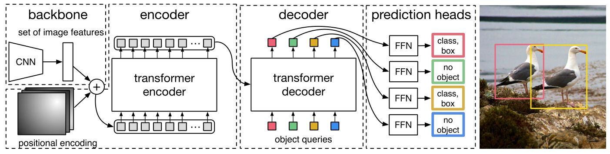
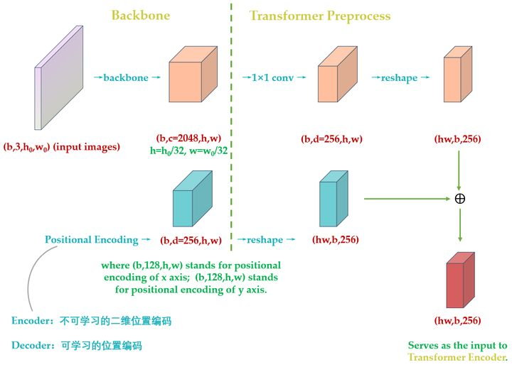
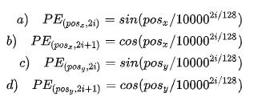

# DETR：End-to-End Object Detection with Transformers
> https://zhuanlan.zhihu.com/p/340149804

## 概述
- 文章的主要工作：将Transformer运用到目标检测中，取代现有需要手工设计的工作，如NMS、Anchor生成等；
- 主要贡献：
1. 用Transformer的encoder-decoder一次性生成N个pred boxes。（N为事先设定的值，论文中使用100）
2. 设计了**bipartite matching loss**,基于预测的boxes与GT boxes的二分图匹配计算loss的大小

- 与VIT相比，DETR不是一个完全有Transformer处理的架构，还是需要依赖于CNN作为backbone

## 网络架构
DETR包括四个部分：backbone,encoder,decoder,FFN

### backbone
- 使用BackBone（如ResNet）提取feature map (C=2048,H =H0/32,W=W0/32)
  

### Transformer Encoder 

- **维度压缩**：将BackBone输出的C×H×W维的feature map,先使用1×1卷积处理，将通道数从C压缩到d，即得到d×H×W的 新feature map
- **序列化**：将上一步得到的d×H×W维的feature map reshape 成 d×WH维的 feature map
- **位置编码** 将上一步的feature map 与**positional encoding** 相加，输出 Transformer Encoder
    - Positional Encoding的输出张量是：(B,d,H,W) ，其中 d代表位置编码的长度=256,(H,W)代表张量的位置
    - 特征图上的任意一个点(Hi,Wi)有个位置编码，这个编码的长度是256，其中，前128维代表Hi的位置编码，后128维代表Wi的位置编码。
    - 
    - 计算所有的位置的编码，得到(B,256,H,W),把它序列化为(HW,B,256)维的positional encoding
### Transformer Decoder
**输入**：Transformer Decoder的输入主要包括两部分：
- Transformer Encoder 输出的 image embedding 与 positional encoding 的和
- object queries

### FFN (Feed-Forward Network)
有两种FFN一种用来预测bbox的中心位置、宽高，一种是预测class标签

##  LOSS
- 预测框数量为N，而实际GT框的数量为M，设定时N远大于M。如何匹配计算loss。
- 为了解决这一问题，人为构造了一个新的物体类别X(表示没有物体)，加入到image objects中，上述(N-M)个pred embedding会与此类别匹配。
- 定义好每一对pred与GT的匹配cost，使用匈牙利算法快速找到使得总cost最小的二分图匹配方案。
- 当配对的GT类别为X时，将loss设置为0，当配对的GT类别是真实目标，如果预测的pred与GT的类型相同的概率越大，或者box差距越小，则配对的cost越小。