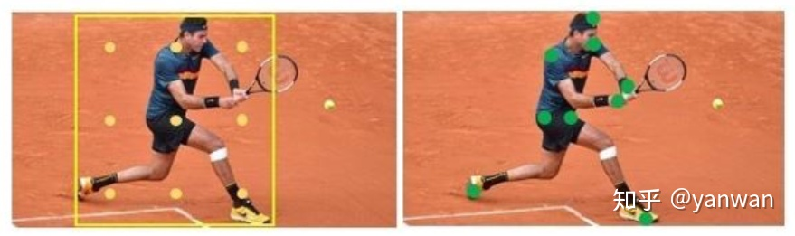

# RepPoints:Point Set Representation for Object Detection

## 目标表示
- 使用代表性点集(Representative Points)表示目标位置
- 优点：能够适应物体的姿态变化，从而提供对目标更细致的几何描述

## 正负样本
- 一阶段
  -  分层，计算每一层的Feature Map Bin 
  -  当目标的GT中心落在对应的FeatureMapBin则为正样本
- 二阶段
  -  将GT和一阶段产生的伪框IOU大于0.5为正样本，小于0.4为负样本，中间忽略。

## 损失函数
1. 分类Loss： Focal Loss
2. 回归Loss:  SmoothL1Loss 
   - 将respoint 转化为伪框，然后计算伪框左上角、右下角和GT的point 损失 
  
## 总结
创造性的使用点集表示目标框

